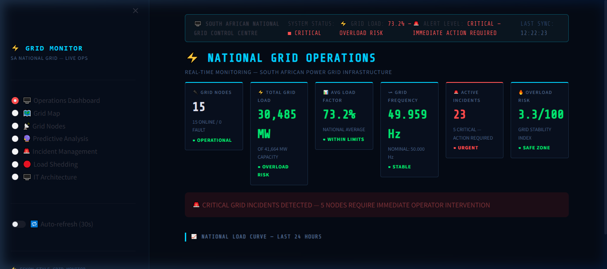
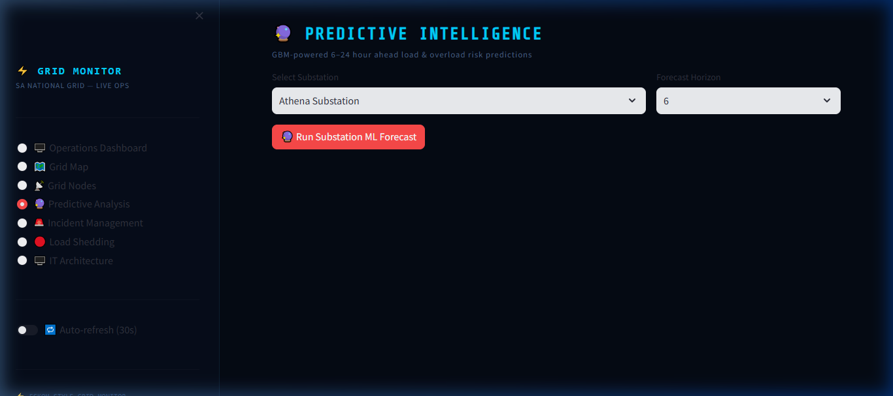
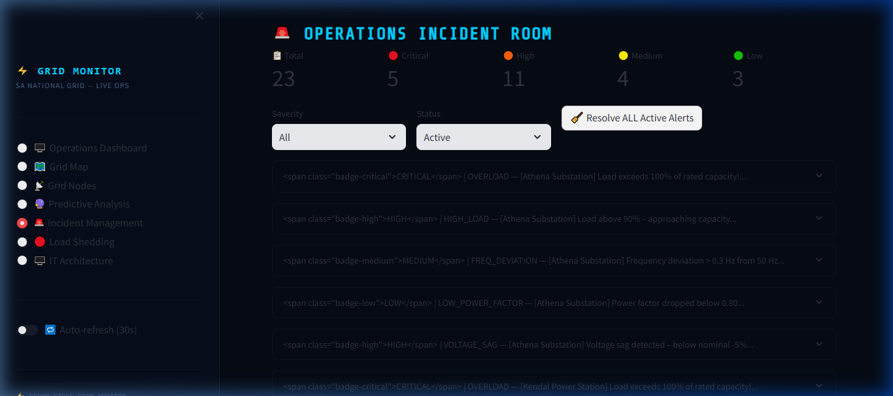

# Power Grid Monitoring System

## Overview
The **Power Grid Monitoring System** is a full-stack solution designed to track electricity usage and predict overload risks to support proactive decision-making. 

This platform continuously monitors the ongoing load on substation components, uses Machine Learning to forecast peak consumption periods, and visualizes system health through an interactive real-time dashboard.

## Key Features
* **Real-time Monitoring:** Real-time data pipeline for tracking load distribution and capacity.
* **Overload Prediction:** Machine Learning models designed to predict system overloads ahead of time, mitigating the risk of power outages.
* **Interactive Dashboard:** A Streamlit-based web dashboard providing visualized metrics for operational decision-making.
* **Robust Backend:** A lightweight, high-performance API powered by FastAPI.
* **Data Storage:** Scalable data storage handled by PostgreSQL.

## Technologies Used
* **Backend Framework:** FastAPI (Python)
* **Data Processing:** Pandas, NumPy
* **Frontend/Dashboard:** Streamlit
* **Database:** PostgreSQL
* **Machine Learning:** Scikit-Learn
* **Testing & Mocks:** Pytest, Locust

## Setup & Installation

1. **Clone the Repository**
   ```bash
   git clone https://github.com/Bongani71/power-grid-monitoring-system.git
   cd power-grid-monitoring-system
   ```

2. **Set Up the Virtual Environment**
   ```bash
   python -m venv venv
   source venv/bin/activate  # On Windows use: venv\Scripts\activate
   ```

3. **Install Dependencies**
   ```bash
   pip install -r requirements.txt
   ```

4. **Environment Variables**
   Make a copy of `.env.example` and rename it to `.env`, then update it with your database credentials.

5. **Initialize Database**
   ```bash
   python seed.py
   ```

6. **Run the Application**
   For Windows environments, simply execute the run script:
   ```powershell
   .\run.ps1
   ```
   Or start the API and dashboard manually:
   ```bash
   uvicorn main:app --reload
   streamlit run dashboard/app.py
   ```

## Documentation
Additional architectural details, decision logs, and API reference can be found in `System_Documentation.pdf`.

## Dashboard Preview

### Operations Control Room


### Predictive Analysis


### Incident Management

